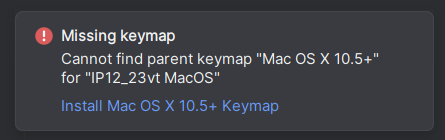
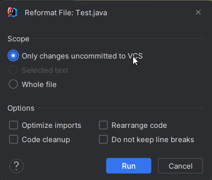

= Coding Conventions

== Verwendete Konventionen

Die im Folgenden beschriebenen Konventionen wurden von https://javabeginners.de/Grundlagen/Code-Konventionen.php[Javabeginners] & https://fhnw-projecttrack.atlassian.net/wiki/spaces/IP1223vt/pages/27132507[Confluence] entnommen und angepasst.

=== Versionshistorie

|===
|Version |Beschreibung |Datum |Autor

|1.0
|Fertigstellung
|22.10.2023
|Berfan Korkmaz
|===

=== Informationen
==== Git Konventionen
Es ist auch wichtig, dass Git einheitlich und organisiert verwendet wird.

==== Voreinstellungen
Einige der Punkte, die hier genannt werden, können über IntelliJ automatisch eingestellt werden. Diese Einstellung kann unten heruntergeladen werden. Zusätzlich kann über GitLab die Codequalität automatisch überprüft werden.

Sie können die IntelliJ-Voreinstellungen unter https://gitlab.fhnw.ch/ip12-23vt/ip12-23vt_elektroautos/docu/-/blob/main/assets/Elektroautos_Einstellungen.zip?ref_type=heads[/assets/Elektroautos_Einstellungen.zip] herunterladen.

Nachdem Sie die Einstellungen importiert haben, kann es sein, dass sie eine Warnung erhalten mit “Missing keymap”, die Einstellung hat modifizierte Keybinds für das Formatieren des Codes auf Windows & Mac. Das heisst, dass Sie möglicherweise auf Windows eine Warnung für Mac Keybinds erhalten und vice versa.

Ein Beispiel für so eine Formatierung sehen Sie unten. Mithilfe der neu importierten Keybinds können Sie per Tastenklick ihr Code formatieren lassen. *Wählen Sie die Zeile, die Sie formatieren möchten* und drücken Sie für Windows `CTRL + Shift + S` und für MacOS `Command + Shift + S`.

*Warnung*: Wenn Sie nicht die Zeile wählen, die Sie formatieren möchten, formatiert es das gesamte Programm. Das ist nicht ideal, falls Sie Ihren Code pushen möchten und Ihre Änderungen sehen möchten, da Git auch Whitespaces in den Commits anzeigt.

*Hinweis*: Wenn Sie jedoch alle Ihre Änderungen formatieren möchten, können Sie das mit `CTRL + ALT + SHIFT + S` für Windows, und `COMMAND + OPTION + SHIFT + S` für MacOS tun. Nachdem Sie diese Tastenkombination betätigt haben, sollte ein Pop-up-Fenster auftreten, wählen Sie dann “Only changes uncomitted to VCS” (Siehe Abbildung unten).

===== Beispiele
Unformatiert, entspricht nicht den Normen:

[java]
----
String javaVersion = System.getProperty("java.version");
String javafxVersion = System.getProperty("javafx.version");
----

Formatiert:
[java]
----
String javaVersion   = System.getProperty("java.version");
String javafxVersion = System.getProperty("javafx.version");
----

===== Zusätzliches Tool: SolarLint
SolarLint sorgt für einen “cleanen Code”, direkt in deiner IDE. Hierzu musst du das https://www.sonarsource.com/products/sonarlint/ide-login/[Plugin installieren] und in deiner IDE einbetten. Auf der Website siehst du, wie das funktioniert.

=== Coding Conventions
Um die Klarheit der Syntax, deren Wartungsaufwand und ihre Lesbarkeit zu optimieren, schreibt Oracle in seinen https://www.oracle.com/technetwork/java/index-135089.html[Code Conventions] Regeln zur syntaktischen Korrektheit von Java-Quelltexten vor.

==== Quelltext-Dateien
Quelltext-Dateien sind diese Dateien, in denen dein Java Code - dein Quellcode - steht.

_Folgende Konventionen gelten für Quelltext-Dateien:_

1. Quelltext-Dateien haben die Endung `.java`

2. Die Datei sollte nicht mehr als 2’000 Zeilen haben

3. Quelltext-Dateien sollten nur jeweils eine `public` deklarierte Klasse oder ein Interface enthalten.

4. Der Name der Datei und der Klasse müssen übereinstimmen und im `CamelCase` geschrieben werden.

5. Korrekte Ordnung der Datei

===== Beispiele & Erläuterungen
*Nicht gut:* Die Datei heisst `HalloWelt`, die Klasse aber `HelloWorld`.
[java]
----
Dateiname: HalloWelt.java
--------------------------------------------

public class HelloWorld {
  public static void main(String[] args) {
    System.out.println("Ich breche die Konventionen, muhaha!");
  }
}
----

*Super*: Die Datei und auch die Klasse heissen beide `HelloWorld`.
[java]
----
Dateiname: HelloWorld.java
--------------------------------------------

public class HelloWorld {
  public static void main(String[] args) {
    System.out.println("Ich breche die Konventionen nicht!");
  }
}
----

Quelltext-Dateien sollten die folgende Ordnung aufweisen:

1) Einfacher mehrzeiliger Einleitungskommentar mit den folgenden Informationen

----
/**
* HelloWorld - Ein einfaches Beispielprogramm.
*
* Dieses Programm wurde von Max Mustermann am 18. Oktober 2023 erstellt.
* Copyright (c) 2023 Max Mustermann. Alle Rechte vorbehalten.
* Das Programm dient dazu, "Hallo, Welt!" auf der Konsole auszugeben.
*/
----

2) Package-Statement
----
package com.example.helloworld;
----

3) Import-Anweisungen
----
import java.util.Scanner;
----

4) Klassen-/Interface-Dokumentation als Javadoc-Kommentar
----
/**
* Die HelloWorld-Klasse enthält die Hauptmethode zur Ausführung des Programms.
*/
----

5) Klassen-/Interface-Statement
----
public class HelloWorld { ... }
----

6) Statische Variablen in der Reihenfolge: public, protected, private
----
public static final int GREETING_SIZE = 10;
protected static int greetingCount = 0;
private static String programTitle = "HelloWorld";
----

7) Instanzvariablen in der Reihenfolge: public, protected, private
----
public String userName;
protected int userAge;
private String userLocation;
----

8) Konstruktoren
----
public HelloWorld() { ... }
----

9) Methoden
----
public HelloWorld(String name, int age) { ... }
----

Beispieldatei mit den Konventionen:
----
/**
* HelloWorld - Ein einfaches Beispielprogramm.
*
* Dieses Programm wurde von Max Mustermann am 18. Oktober 2023 erstellt.
* Copyright (c) 2023 Max Mustermann. Alle Rechte vorbehalten.
* Das Programm dient dazu, "Hallo, Welt!" auf der Konsole auszugeben.
*/

package com.example.helloworld;

import java.util.Scanner;

/**
* Die HelloWorld-Klasse enthält die Hauptmethode zur Ausführung des Programms.
*/
public class HelloWorld {

    public static final int GREETING_SIZE = 10;
    protected static int greetingCount = 0;
    private static String programTitle = "HelloWorld";

    public String userName;
    protected int userAge;
    private String userLocation;

    public HelloWorld() {
        // Konstruktor-Code hier
    }
}
----

==== Binärcode-Dateien
Eine Binärcode-Datei ist das Ergebnis der Kompilierung einer Quelltext-Datei. Sie enthält den ausführbaren Java Bytecode.

_Folgende Konvention gilt für Binärcode-Dateien:_

1. Quelltext-Dateien haben die Endung `.class`

==== Zeilen
_Folgende Konventionen gelten für Zeilen:_

1. Die Zeilenlänge sollte `120` Zeichen *nicht* überschreiten

2. Die Zeile sollte eine Einrückung von 4 Leerzeichen (1x Tab) haben

===== Beispiele & Erläuterungen
Notwendige Zeilenumbrüche sollten nach den folgenden Regeln erfolgen:

1) Nach Kommata
----
String[] namen = {"Alice", "Bob", "Charlie", "David", "Eve",
                 "Frank", "Grace", "Hank"};
----

2) Vor Operatoren bei grösseren Rechnungen
----
int ergebnis = zahl1
             + zahl2
             - zahl3
             * zahl4
             / zahl5;
----

3) Höherrangige Umbrüche bevorzugen
----
int gesamtergebnis = (ergebnis1 + ergebnis2) * faktor1
                     + (ergebnis3 - ergebnis4) / faktor2;
----

==== Deklarationen und Initialisierung
Deklarationen von Variablen sollten nur eine pro Zeile erfolgen, um sie mit vorangesetzten Kommentaren versehen zu können. Mehrere Deklarationen pro Zeile sind bei gleichem Typ jedoch möglich.

==== Klassen-, Interface- und Methodendeklaration
1. Kein Leerzeichen zwischen Methodennamen und der folgenden öffnenden runden Klammer

2. Die öffnende geschweifte Klammer eines Blockes sollte, mit einem Leerzeichen getrennt, in der Zeile des Deklarations-Statements stehen

3. Die schließende geschweifte Klammer eines Blockes sollte in einer neuen Zeile auf Einrückungsebene des zugehörigen Statements erscheinen

----
void print(int i) {
    System.out.println(i);
}
----

==== Statements
1. Für jedes Statement sollte eine eigene Zeile verwendet werden

2. Bei Bedingungen und Verzweigungen sollten, wie bei Methoden auch, die geschweiften öffnenden Klammern des Blockes am Ende der Statementzeile stehen. Die schließende geschweifte Klammer eröffnet eine neue Zeile auf Einrückungsebene des Statements

----
for (int i = 0; i < 10; i++) {
    if (i == 5) {
        System.out.println(i);
    }
}
----

==== Leerzeichen
...stehen zwischen Schlüsselwörtern und runden Klammern, jedoch nicht nach Methodennamen.

...stehen nach Kommata in Argumentlisten:
----
void print(int i, double j)
----

…stehen zwischen binären Operatoren und ihren Operanden:
----
int i = 5;
----

...stehen nicht zwischen unären Increment- und Decrement-Operatoren und deren Operanden
----
a++, --i
----

...stehen zwischen den Ausdrücken eines for-Statements
----
for (int i = 0; i < 5; i++)
----

...stehen nach expliziten Casts
----
float f = 3.14f;
double d = (double) f;
----

==== Namenskonventionen
Alle Bezeichner sollten grundsätzlich beredt sein, und möglichst intuitiv den Zweck angeben, für den sie stehen. Lediglich nur kurzfristig benötigte Werte, wie bspw. Zählvariablen, können durch Kurzbezeichner repräsentiert werden. Alle Bezeichner müssen aus alphanumerischen Zeichen des ASCII-Zeichensatzs bestehen, dürfen Unterstriche enthalten, jedoch nicht mit einer Ziffer beginnen.

Klassen- und Interface-Bezeichner sollen mit grossem Anfangsbuchstaben in CamelCase-Schreibweise geschrieben werden.
----
class TestConverterGUI
----

Variablen- und Methoden-Bezeichner sollen mit Ausnahme von Klassenkonstanten mit kleinem Anfangsbuchstaben in CamelCase1-Schreibweise geschrieben werden
----
String studentName;
void printStudentName()
----

Klassenkonstanten (static final deklarierte Variablen) werden durchgehend mit Großbuchstaben geschrieben. Werden mehrere Worte verwendet, so werden diese durch Unterstriche getrennt.
----
static final int BORDER_WIDTH = 5;
----

=== Andere Qualitätsanforderungen
==== Vokabular
Alle Personen, die Code schreiben, sollten die gleichen Wörter für die Benennung von Variablen, Klassen, etc. verwenden. So kann der Code besser gelesen und entsprechend verstanden werden.

== Sicherstellung der Einhaltung der Konventionen

Mit den erwähnten Tools hat man bereits eine Hilfestellung für das Formatieren und Einhalten der Source-Code-Qualität. Ob die Regelungen und Konventionen aber von allen Teammitgliedern eingehalten wird, überprüft der SC (Dev). Bevor ein Code in die `main` oder `development` Branch gepushed werden kann, muss ein Merge-Request erstellt werden und diese muss vom SC (Dev) oder vom Stellvertreter überprüft und akzeptiert werden.

'''
Zuletzt aktualisiert: 24. Oktober 2023