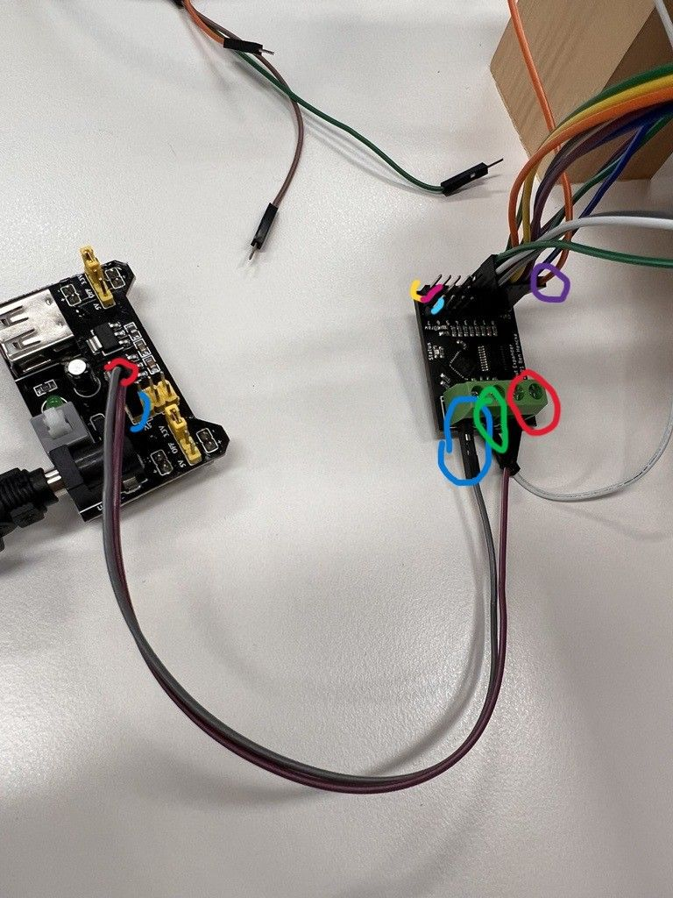
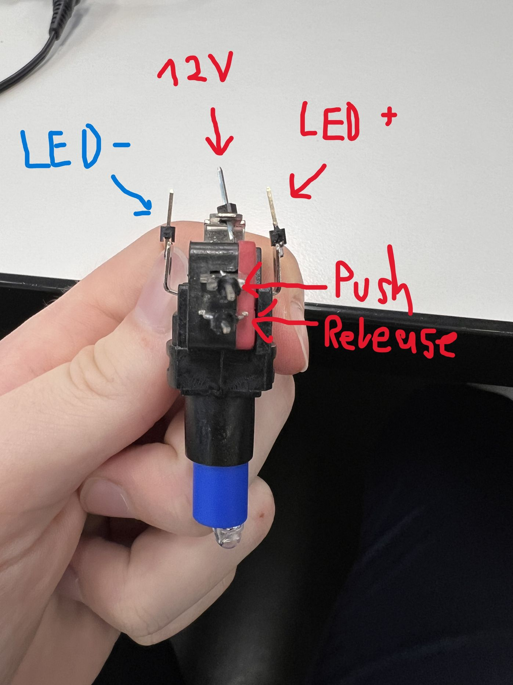

image::images/pi4j-header.png[]

_Hier stehen die Informationen zur Hardware._

Informationen zum Erstellen und Zusammenbauen finden Sie hier: https://www.cs.technik.fhnw.ch/confluence20/display/IP1222vt/Material[]

==== Kit I2C digital input Module

Pi4j Library:
https://pi4j.com/documentation/io-examples/i2c/

Produktlinks:

Input Board für LED-Buttons:
https://www.horter-shop.de/en/i2c-din-rail-modules/105-432-kit-i2c-digital-input-module-4260404260714.html#/25-terminals-fixed_terminals/28-pcf_type-pcf_8574_a_adress_112_128

Output Board für LED-Buttons:
https://www.horter-shop.de/en/i2c-din-rail-modules/117-426-kit-i2c-digital-output-module-4260404260721.html#/25-terminals-fixed_terminals/27-pcf_type-pcf_8574_address_64_78

Raspery-Pi:
https://www.pi-shop.ch/raspberry-pi-4-model-b-4gb

LED-Buttons:
https://www.berrybase.ch/massive-arcade-button-100mm-beleuchtet-led-12v-dc?sPartner=g_shopping_ch&utm_source=google&utm_medium=cpc&gad_source=1&gclid=Cj0KCQjwpNuyBhCuARIsANJqL9P6nN001aoD8MNpw0NCP5pZFrSWK_ONpbY1Qf369o4Lzos4fcshHioaAuzuEALw_wcB

Bildschirm:
https://www.digitec.ch/de/s1/product/verbatim-pm-14-1920-x-1080-pixel-14-monitor-24552684?supplier=406802&utm_source=google&utm_medium=cpc&utm_campaign=PROD_CH_PMAX_GSE_Cluster_10&campaignid=20501579759&adgroupid=&adid=&dgCidg=Cj0KCQjwpNuyBhCuARIsANJqL9OjJNr9zauhyFgvN1zIW1I1xdhNa2vID2zGsd1LxEfKmCTYEYJUK2UaAurcEALw_wcB&gad_source=1&gclid=Cj0KCQjwpNuyBhCuARIsANJqL9OjJNr9zauhyFgvN1zIW1I1xdhNa2vID2zGsd1LxEfKmCTYEYJUK2UaAurcEALw_wcB&gclsrc=aw.ds

RFID-Reader:
https://www.berrybase.ch/rfid-lesegeraet-mit-spi-schnittstelle-inkl.-karte-dongle?sPartner=g_shopping_ch&utm_source=google&utm_medium=cpc&gad_source=1&gclid=Cj0KCQjwpNuyBhCuARIsANJqL9P7o4AFCi0YQ4gf8Dh4CRXPPrhIBWHknIZdTkqOl-r9hdvwGedPmOcaAmuqEALw_wcB

RFID-Chip:
https://www.berrybase.ch/rfid/nfc-schluesselanhaenger-13-56mhz-1kb

Rasperry-Pi Pico:
https://www.digitec.ch/de/s1/product/raspberry-pi-pico-entwicklungsboard-kit-14697589?dbq=1&supplier=406802&utm_source=google&utm_medium=cpc&utm_campaign=PROD_CH_PMAX_CSS_Cluster_8&campaignid=20496494580&adgroupid=&adid=&dgCidg=Cj0KCQjwpNuyBhCuARIsANJqL9Mglsn_vsvOStxYDYf8OvMN3iDOk68T94epfg-Im2U6KXZywEPWF-AaAhMnEALw_wcB&gad_source=1&gclid=Cj0KCQjwpNuyBhCuARIsANJqL9Mglsn_vsvOStxYDYf8OvMN3iDOk68T94epfg-Im2U6KXZywEPWF-AaAhMnEALw_wcB&gclsrc=aw.ds

LED-Strip:
https://www.bastelgarage.ch/ws2812b-60led-m-led-neopixel-strip-0-165m

==== Rasperry Pi
Der Rasperry Pi verfügt über folgende Anschlüsse und Schnittstellen:

Anschlüsse:
- 4 x USB-Anschlüsse: 2 x USB 3.0 und 2 x USB 2.0.
- 2 x Micro-HDMI-Anschlüsse: Unterstützt Dual-Monitor-Betrieb mit Auflösungen bis zu 4K.
- Gigabit Ethernet-Port: Für schnelle Netzwerkverbindungen.
- Bluetooth 5.0 und WLAN: Für drahtlose Verbindungen.

GPIO-Pins:
- 40-Pin-GPIO-Header für den Anschluss externer Geräte und Sensoren.

Speicher und Betriebssystem:

- MicroSD-Kartensteckplatz für das Betriebssystem und Speicher.

- Unterstützt verschiedene Linux-basierte Betriebssysteme, wie Raspberry Pi OS.

==== Verbindungen zu externen Komponenten (Raspberry Pi)

Buttons:

Buttons können mit den GPIO-Pins des Raspberry Pi verbunden werden & benötigen zwei Verbindungen: eine zum GPIO-Pin und eine zu einem Ground (GND)-Pin. Da unsere Buttons über 12V verfügen, müssen diese zusätzlich über ein Input- & Output Board mit dem Rasperry Pi verbunden werden.

- Eine Seite des Buttons an einen GPIO-Pin

- Andere Seite des Buttons an GND (Pin 6)

Bildschirm:

- Bildschirm über ein HDMI-Kabel an einen der beiden HDMI-Anschlüsse des Rasperry Pi anschliessen.

RFID-Reader:
Ein RFID-Reader kann über die UART-, SPI- oder I2C-Schnittstelle verbunden werden.

- SDA zu GPIO 8 (Pin 24)

- SCK zu GPIO 11 (Pin 23)

- MOSI zu GPIO 10 (Pin 19)

- MISO zu GPIO 9 (Pin 21)

- IRQ (nicht benötigt)

- GND zu einem GND-Pin (Pin 6)

- RST zu GPIO 25 (Pin 22)

- 3.3V zu 3.3V (Pin 1)

Rasperry Pi Pico:

Der Raspberry Pi Pico kommuniziert über die UART-Schnittstelle mit dem Raspberry Pi 4. Da nur in eine Richtung kommuniziert wird, wird nur TXD des Raspberry Pi 4 benötigt.
Schnittstellen:

- TX (GPIO 14, Pin 8) des Raspberry Pi 4 zu RX des Raspberry Pi Pico (GP 1, Pin 2).

- 3.3 Volt des Raspberry Pi's zu Pi Pico VSYS (GPIO, Pin 39).

- GND zu GND. **WICHTIG: GND muss von Pi und Pico geteilt werden.**

LED-Streifen:

- Datenleitung des LED-Streifens zu einem GPIO-Pin.

- 5V des LED-Streifens zu einem 5V-Pin (Pin 2 oder 4).

- GND des LED-Streifens zu einem GND-Pin (Pin 6).

==== LED Strip
Der Pixelblaze Output Expander, ermöglicht es über ein Ground und einen GPIO Pin (GPIO 14 (UART Transmit)) auf dem Raspberry Pi 8 LED Streifen gleichzeitig anzusteuern.

Um genügend Spannung und Strom für die LEDS zu haben, muss der Strom über ein weiteres Netzteil bezogen werden, dieser wird mit den Kabeln, mit rot (5V) und blau (GND) markiert verbunden.

Das Data-Kabel ist grün markiert und wird in den (GPIO 14 (UART Transmit)) eingesteckt, das auf der Seite verbundene GND-Kabel (Violet) des Extension-Boards wird auf ein GND des Raspberry Pi verbunden.

Nun müssen nur noch die Din Ports der LED’s zu den Data Ports (Hellblau) des Extension-Boards eingesteckt werden. +5v zu 5v (Pink) und GND zu GND (Gelb). Dabei muss beachtet werden das eine Reihe mit Data, 5V und GND jeweils ein Channel ist und ein LED pro Channel verbunden werden muss.

Das Ansteuern durch die Software wurde mit Hilfe des https://pi4j.com/examples/jbang/pixelblaze_output_expander/[Pixelblaze Output Expander Tutorials] umgesetzt. Dadurch konnten wir eine Testfunktion schreiben und entsprechende Channel ansteuern mit einer bestimmten Anzahl an LEDs und die RGBs als Bytes. Das sieht am Ende dann so aus:

[source,java]
----
private static void testLedStrip(boolean skip, int channel) {
        if (skip) return;
        LOGGER.logInfo("Testing LED-Strip code!");
        LedStrip ledStrip = new LedStrip();

        try {
            LOGGER.logInfo("Attempting to send one by one");
            final int ledsToActivate = 25;
            ledStrip.sendMany(channel, ledsToActivate, (byte) 0x00, (byte) 0x00, (byte) 0xff);
            Thread.sleep(3000);
            ledStrip.getHelper().sendAllOff(channel, ledsToActivate);
        } catch (InterruptedException e) {
            LOGGER.logError("Interrupted");
        }

        ledStrip.getHelper().closePort();
}
----

Wir initialisieren die Komponente, die wir mit Hilfe des Tutorials erstellt haben. Anschliessend geben wir an, wie viele LEDs wir zum Leuchten bringen wollen und geben die RGB als Hex an, um die Farbe zu bestimmen. Nach drei Sekunden werden die LEDs wieder abgeschaltet und der Port geschlossen.

==== Button und LED
LED -> Mittelstück <- Knopfschnittstelle

Für die Buttons brauchen wir, wie die LED-Strips, einen externen Powersupply.

==== externer Powersupply
Dieser Powersupply gibt 12V auf den untersten Pin. Die zwei Pins links und rechts sind dazu da, um das LED über einen externen Schaltkreis anzusteuern. + = der GPIO Pin für das LED.

==== RFID
Reader:
    Stromversorgung:
        GPIO-Pins des Readers (VCC & GND) mit entsprechenden GPIO-Pins des Rasperry Pi (5V (VCC) & GND) verbinden.
    Dataconnection:
    SPI Pins des Readers mit entsprechenden GPIO-Pins des Rasperry Pi (MOSI, MISU,SCLK & CS) verbinden. 
Chip:
    Keine Anpassung/Installation auf Hardwareebene nötig.    
    

==== Raspberry Pi Pico
Der Rasperry Pi Pico ist ein Mikrocontroller-Board, welches über einen eigenen ARM-Mikrocontroller-Chip mit Dual-Core ARM Cortex-M0+ Prozessoren und einer Vielzahl von Ein- und Ausgabeoptionen. (RP2040) verfügt.

Mit dem Rasperry Pi Pico ist es uns möglich, 2 weitere RFID-Reader mit dem Rasperry Pi zu verbinden.

Um den Rasperry Pi mit dem Rasperry Pi Pico zu verbinden, muss ein GPIO-Pin für den Strom, Ground sowie Dataconnection mit dem Rasperry Pi verbunden werden.
Die RFID-Reader können wie unter "RFID" beschrieben mit dem Rasperry Pi Pico verbunden werden.

==== Material & Werkzeug
Um das Spiel aufsetzen zu können, muss gelötet, geklebt & gebohrt werden.
Benötigte Materialien sind folgende:
- Lötgerät inkl. Verbrauchsmaterialien (Zinn)
- Holzwerkzeuge (Säge, Hobel & Fräse, Bohrer & Schrauben)
- Voltmeter (Messen der Spannung)

==== 3D-Druck

Die 3D-Vorlagen sind unter folgenden Links zu finden:

- https://cults3d.com/de/benutzer/Sim3D_/3d-modelle (Ersteller & weitere Modelle)

- https://cults3d.com/de/modell-3d/kunst/range-rover-evoque-model-for-3d-printing-stl-files

- https://cults3d.com/de/modell-3d/kunst/ssc-tuatara-3d-model-car-for-printing

- https://cults3d.com/de/modell-3d/kunst/alfa-romeo-giulietta-2010-2019-ready-for-printing

- https://cults3d.com/de/modell-3d/kunst/honda-accord-sport-sedan-2018-3d-printable-model

Ladesäulen & Originalvorlagen:
https://fhnw-projecttrack.atlassian.net/wiki/spaces/IP1223vt4/pages/352944151/3D-Modelle

===== Dokumentationslinks
- https://coolcomponents.co.uk/blogs/news/how-to-use-a-big-dome-button[How to use a big dome button]