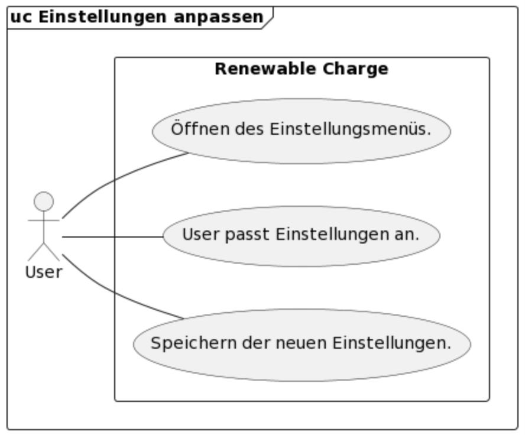
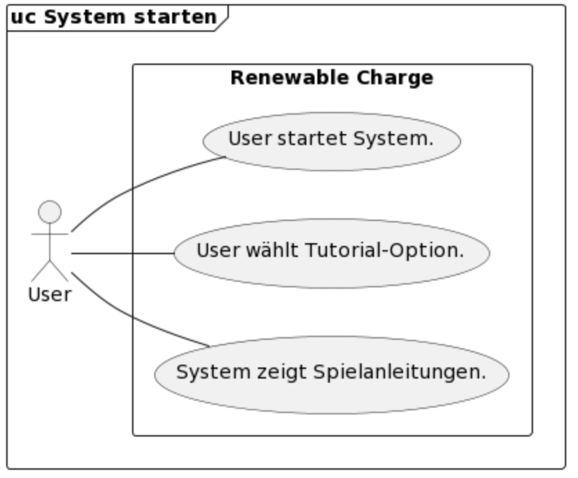
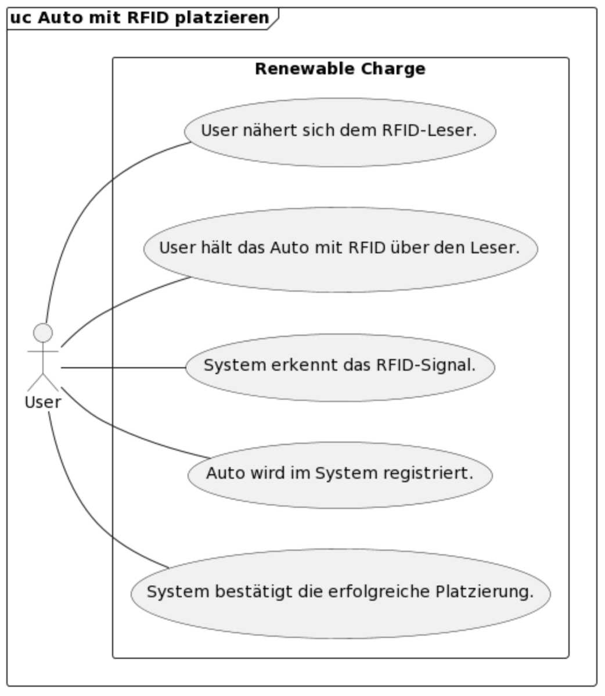
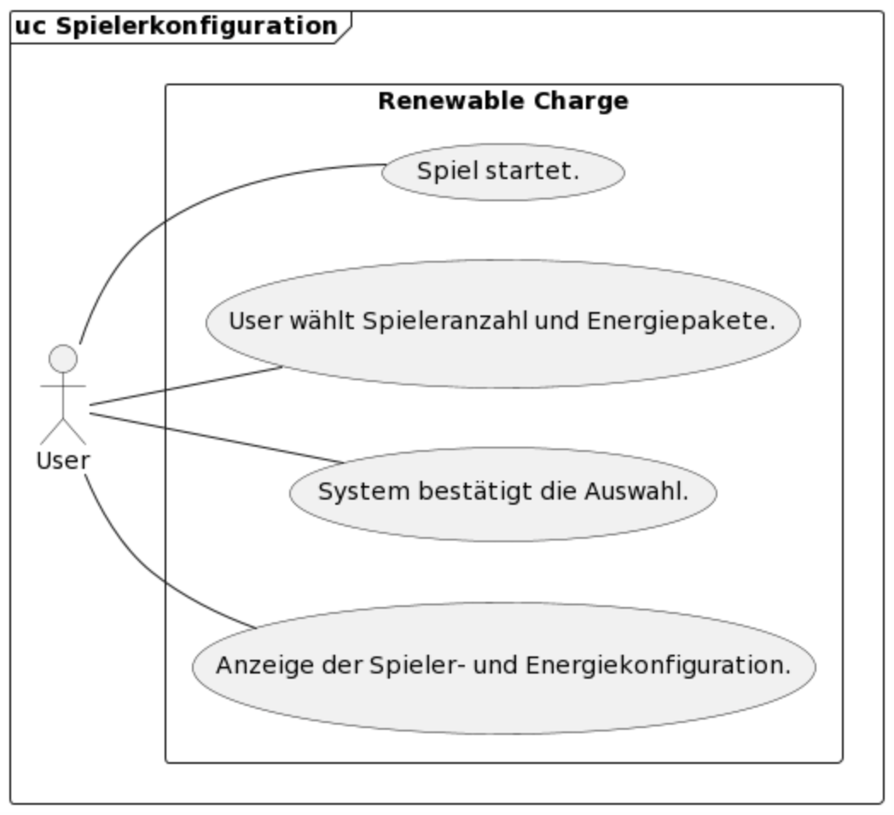
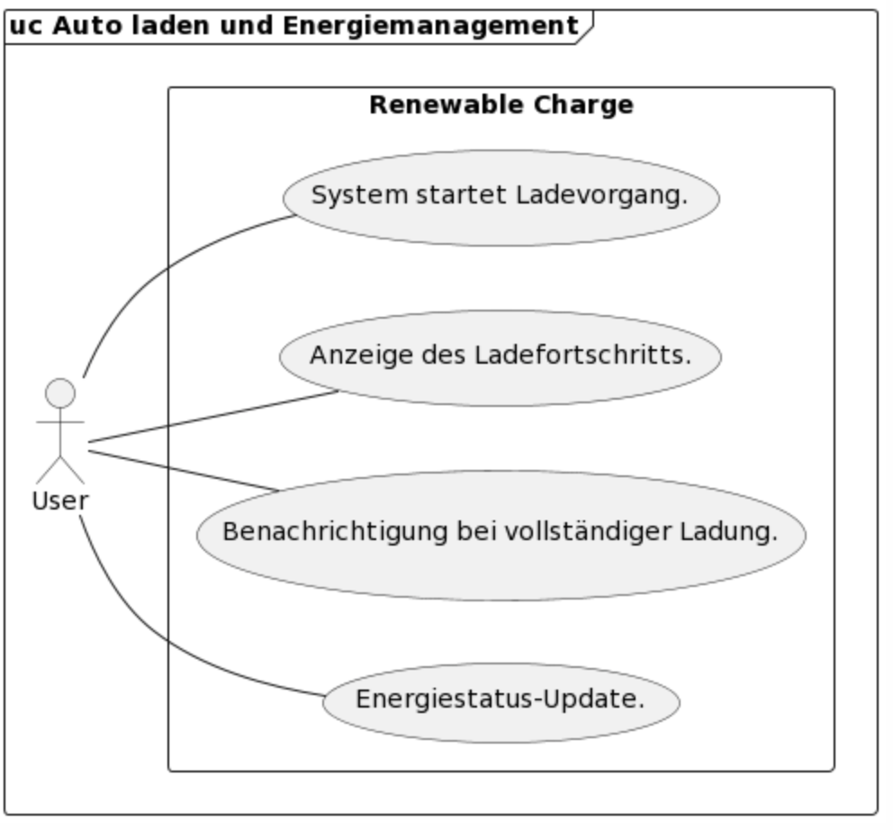
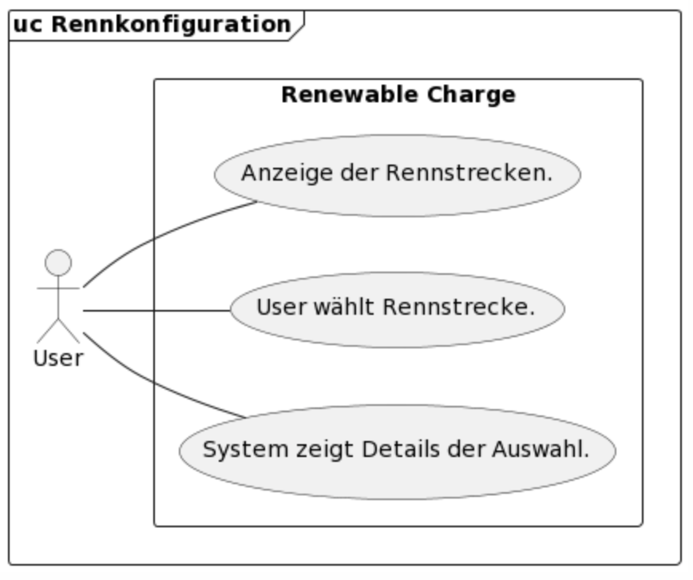
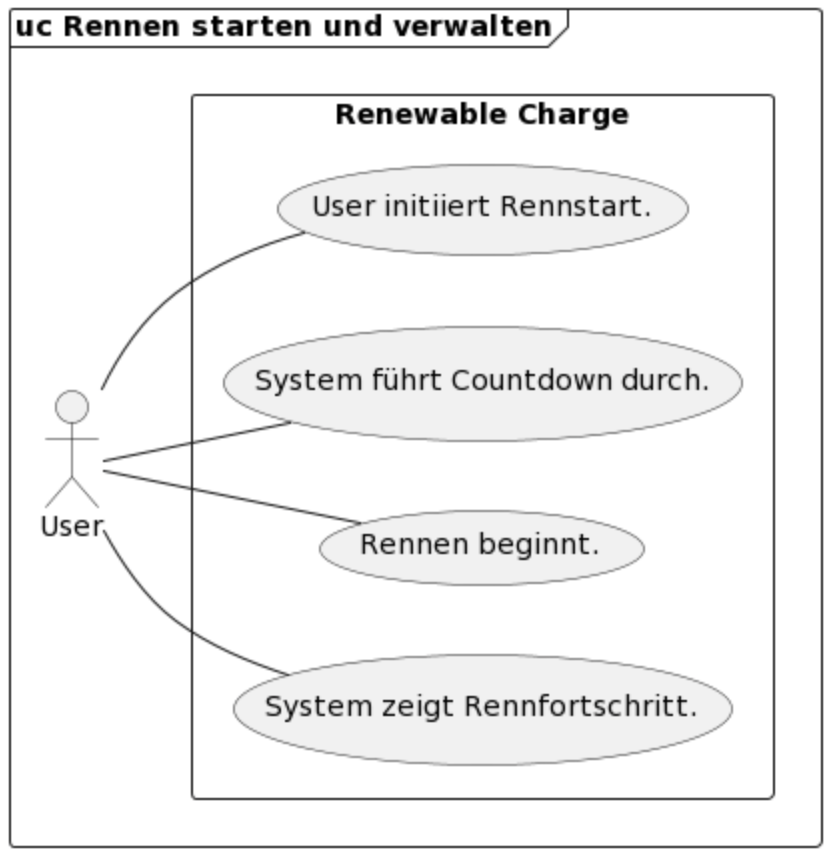
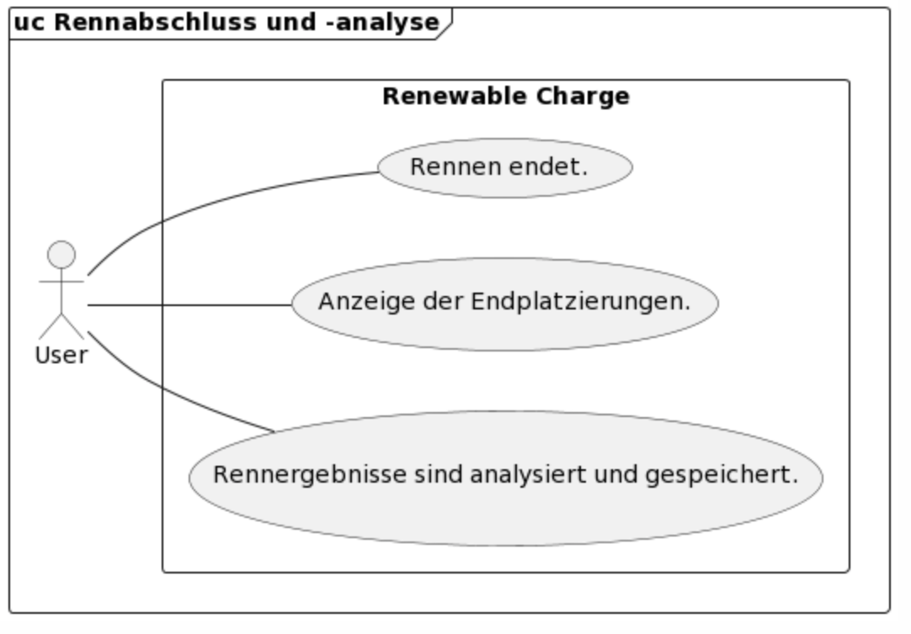

[[section-introduction-and-goals]]
==	Einführung und Ziele

=== Aufgabenstellung

[role="arc42help"]
Die wesentliche Aufgabe unseres Systems ist es, Jugendliche in der 7. bis 9. Klasse über die Herausforderungen und den Energieverbrauch von Elektroautos aufzuklären. Dies schliesst das Bewusstmachen der intermittierenden Natur erneuerbarer Energiequellen und deren Auswirkungen auf das Laden von Elektrofahrzeugen ein. Das System nutzt ein interaktives Spiel, um diese Konzepte in einer ansprechenden und pädagogisch wertvollen Weise zu vermitteln.

=== Funktionale Anforderungen
==== Einstellungen anpassen (UC-001):
- R001: System muss Einstellungsmenü öffnen können.
- R002: System muss Einstellungen anpassen können.
- R003: System muss neue Einstellungen speichern können.

==== System starten (UC-002):
- R006: User muss System starten können.
- R007: User muss Tutorial-Option wählen können.
- R008: System muss Spielanleitungen anzeigen können.
- R009: Tutorial muss anpassbar sein, um unterschiedliche Erfahrungsstufen zu berücksichtigen.

==== Auto mit RFID platzieren (UC-003):
- R010: User muss sich dem RFID-Leser nähern können.
- R011: User muss das Auto mit RFID über den Leser halten können.
- R012: System muss das RFID-Signal erkennen können.
- R013: System muss das Auto im System registrieren können.
- R014: System muss die erfolgreiche Platzierung bestätigen können.
- R015: System muss eine Benutzeroberfläche bereitstellen, die den Platzierungsstatus des Autos anzeigt.
- R016: System muss eine Fehlermeldung anzeigen, wenn das RFID-Signal nicht erkannt wird.

==== Spielerkonfiguration (UC-004):
- R017: System muss das Spiel starten.
- R018: User muss Spieleranzahl und Energiepakete auswählen können.
- R019: System muss die Auswahl bestätigen können.
- R020: System muss die Spieler- und Energiekonfiguration anzeigen können.
- R021: System muss die Spielerkonfiguration für zukünftige Spiele speichern können.
- R022: System muss eine Option bieten, die Konfiguration zu ändern.

==== Auto laden und Energiemanagement (UC-005):
- R023: System muss Ladevorgang starten können.
- R024: System muss Ladefortschritt anzeigen können.
- R025: System muss Benachrichtigung bei vollständiger Ladung senden können.
- R026: User muss Ladevorgang vorzeitig beenden können.
- R027: System muss Energiestatus aktualisieren können.
- R028: System muss Warnungen bei niedrigem Energiestand ausgeben.
- R029: System muss Energiemanagement-Statistiken bereitstellen.

==== Rennkonfiguration (UC-006):
- R030: System muss Rennstrecken anzeigen können.
- R032: System muss Details der Auswahl anzeigen können.
- R033: System muss eine Vorschau der Rennstrecken bereitstellen.

==== Rennen starten und verwalten (UC-007):
- R035: User muss den Rennstart initiieren können.
- R036: System muss den Countdown durchführen können.
- R037: Rennen muss beginnen können.
- R038: System muss den Rennfortschritt anzeigen können.

==== Rennabschluss und -analyse (UC-008):
- R040: Rennen muss enden können.
- R041: System muss Endplatzierungen anzeigen können.

=== Qualitätsziele
Die Software Archidektur muss folgende 3 haupt Qualitätsziele gewärleisten: Wartbarkeit, Benutzerfreundlichkeit, Leistungseffizienz. 
[Attributes]
|===
|Nr. |Qualitätsziel | Priorität | Beispiel

|Qz01
|Wartbarkeit
|1
|Die Spielparameter müssen inerhalb von 5 Minuten über das app.properties File angepasst werden können.

|Qz02
|Benutzerfreundlichkeit
|2
|Das Spiel muss selbsterklärend aufgebaut sein, das Jugentliche in der 7.-9. Klasse das Spiel innerhalb von 30'' gut genug verstehen, dass sie es spielen können.

|Qz03
|Leistungseffizienz
|3
|Die Software muss performant aufgebaut sein, damit eine Latenz von 200 Millisekunden nicht überschritten wird.
|===

[role="arc42help"]
Die Top-3-Qualitätsanforderungen für unsere Architektur sind:

[Attributes]
|===
|Nr. |Qualitätsziel | Priorität | Beispiel

|Qz01
|Wartbarkeit
|1
|Die Spielparameter müssen innerhalb von 5 Minuten über die Datei app.properties angepasst werden können.

|Qz02
|Benutzerfreundlichkeit
|2
|Das Spiel muss selbsterklärend aufgebaut sein, sodass Jugendliche in der 7. bis 9. Klasse das Spiel innerhalb von 30 Sekunden gut genug verstehen, um es spielen zu können.

|Qz03
|Leistungseffizienz
|3
|Die Software muss performant gestaltet sein, sodass eine Latenz von 200 Millisekunden nicht überschritten wird.
|===

=== Stakeholder

[cols="1,1,2" options="header"]
|===
|Rolle |Kontakt |Erwartungshaltung

|Product Owner
|Dieter Holz
|Herr Holz erwartet ein Board-Game, das Jugendlichen auf spielerische Weise die Herausforderungen von Elektroautos und das Laden mit erneuerbarem Strom nahebringt. Das Spiel soll das Bewusstsein für diese Themen fördern und haptische Elemente beinhalten.

|Primeo
|Wolfgang Szabeo
|Die Primeo plant, dieses Spiel in ihrer Austellung zu präsentieren. Dabei soll das Spiel die Besucher zum Ressourcenschonenden Verhalten anspornen und ihr Interesse für erneuerbare grüne Energien wecken.

|FHNW
|Sibylle Peter
|Frau Peter zielt darauf ab, ihre Studierenden auszubilden und interessante Ausstellungen zu gestalten, die als Werbung dienen sowohl auch die nächste Generation für Technik begeistern. Sie möchte den Erfolg des Projekts und die Reputation der FHNW steigern.

|Projektteam
|Teammitglieder
|Das Team strebt danach, ein herausragendes Produkt zu entwickeln, welches alle Stakeholder zufriedenstellt. Ziel ist es, die Produktziele zu erreichen, die Teamzusammenarbeit zu fördern, neues zu lernen und eine gute Bewertung zu erzielen.
|===

