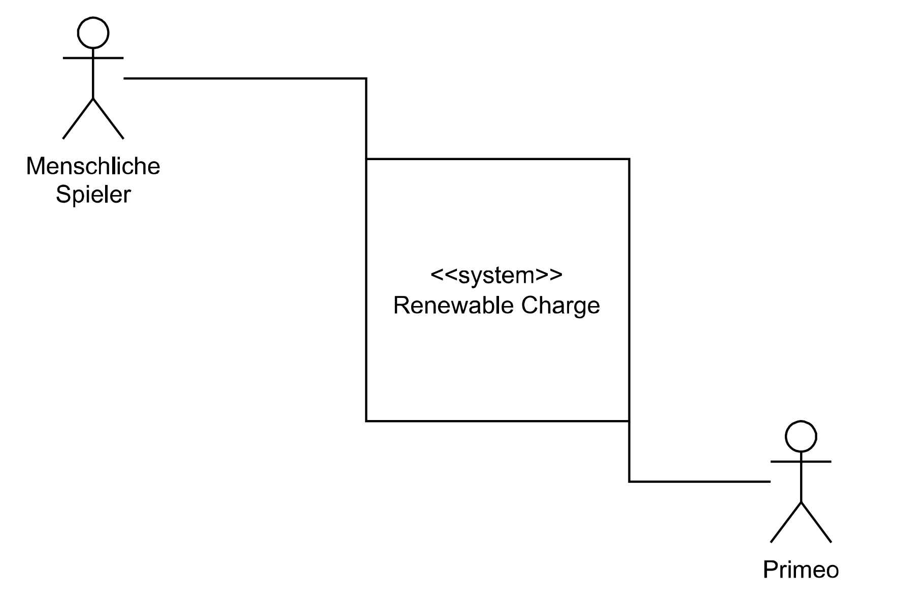

[[section-system-scope-and-context]]
== Kontextabgrenzung

Unser System hat keine externen Schnittstellen, weswegen wir auch keine Kontextabgrenzung haben.

=== Fachlicher Kontext

[role="arc42help"]

*Menschlicher Gegner (Benutzer)* +
Das Renewable Charge Spiel wird mit 2-4  Spielern gespielt.
Die Spieler können ein Auto mit einem RFID Chip auswählen und auf einen RFID Leser stellen. Mithilfe des Knopfes neben Ihrer Ladestation können Sie Pakete für sich aquirieren, wenn sie die ersten sind und noch genügend Kapazität in Ihrem Auto haben.

*Primeo*
Die Primeo wird das Renewable Charge Spiel via das app.properties File konfigurieren. Diese Konfigurationen beinhalten Spielparameter, wie die Durchschnittliche Paketgrösse,das Erweitern mittels weiteren Autos und Übersetzungen. 

=== Technischer Kontext

[role="arc42help"]

Unser System hat keine externen Schnittstellen.