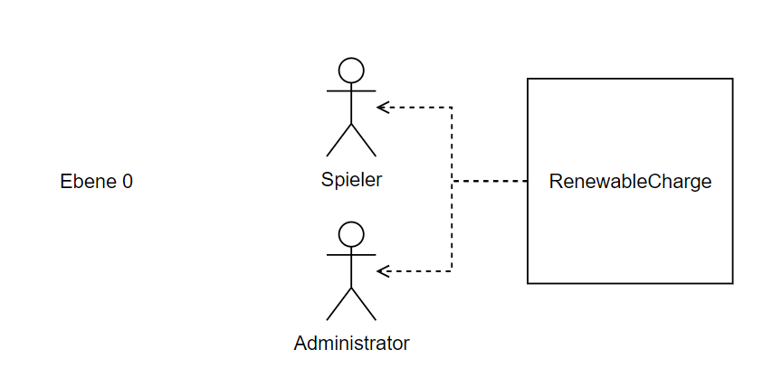
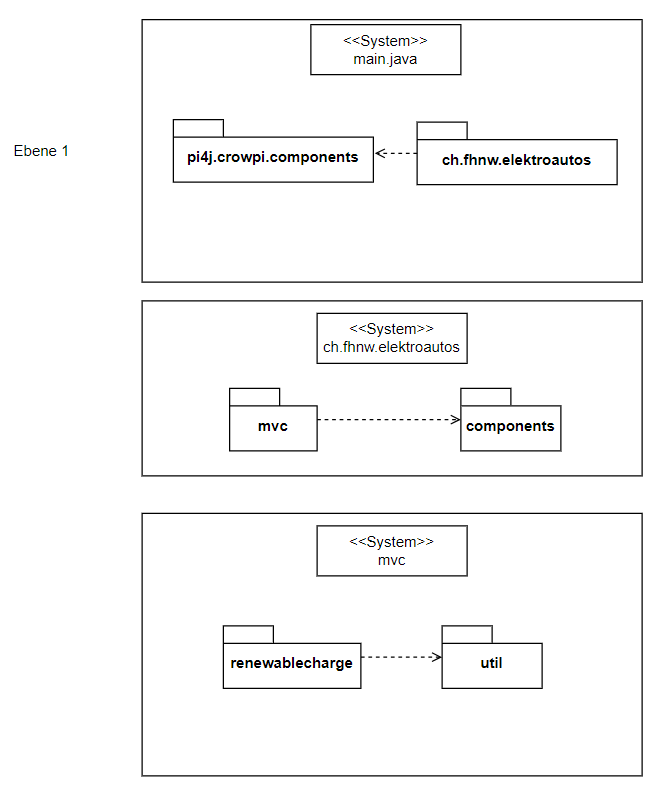
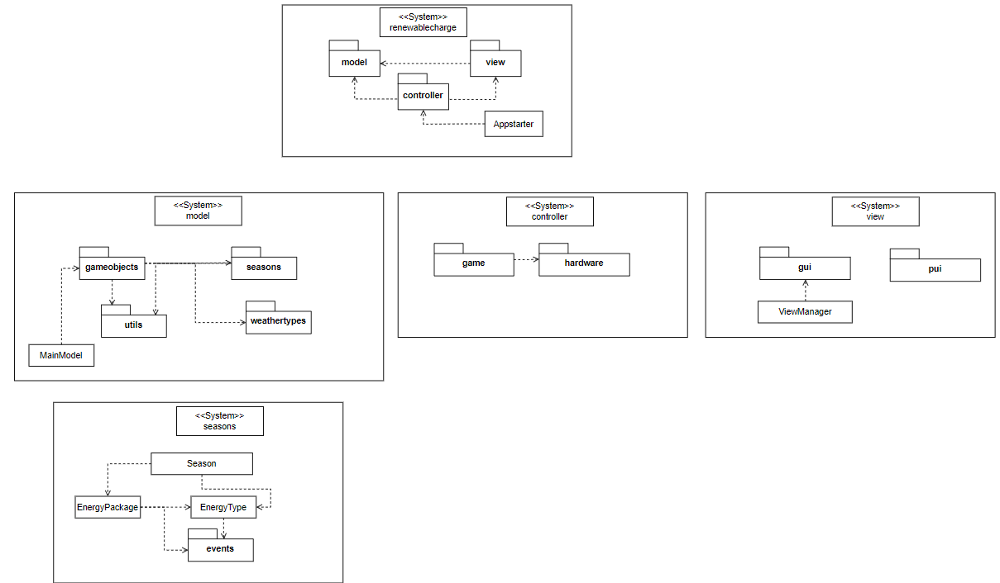
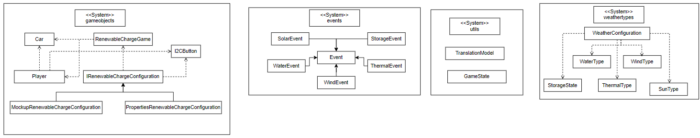
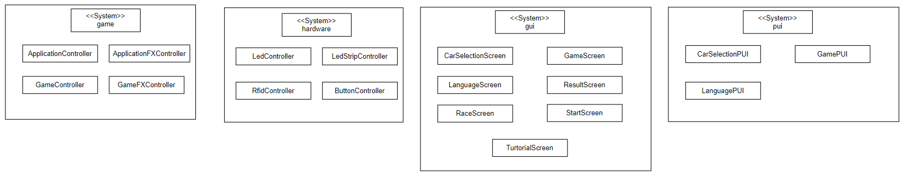

[[section-building-block-view]]
== Bausteinsicht

In diesem Abschnitt wird das Renewable Charge game in die einzelnen Module zerlegt.

=== Whitebox Gesamtsystem

Ebene 0-1

Begründung:: Unser System hat nur eine Systemgrenze mit den Aktoren.

Begründung:: Unser System besteht auf der obersten Ebene in Ebene1 aus den CrowPi-Komponenten und unserem Projektpaket.

Enthaltene Bausteine:: 
|===
| **Name** | **Verantwortung**
| pi4j.crowpi.components |  Dies ist eine Library von pi4j.
| ch.fhnw.elektroautos |  Es beinhaltet die Strucktur des Spiels.
| mvc |  Es besitzt alle Logik des Spiels.
| components |  Ist die Library von Crowpi.
| renewablecharge |  Hier befinden sich die Elemente von dem Spiel.
| util |  Alle Ellemente für die Grundlagen für MVC und die Konfigurationsdateien.
|===

Wichtige Schnittstellen::
- ch.fhnw.elektroautos verwendet die Elemente von chfhnw.elektroautos.
- mvc verwendet die Library von corwpi.
- renewablecharge verwendet die Konfigurationsdateien von util.

Begründung:: Unser System besteht auf der obersten Ebene in Ebene1 aus den CrowPi-Komponenten und unserem Projektpaket.

Enthaltene Bausteine:: 
|===
| **Name** | **Verantwortung**
| model |  Beinhaltet alle Klassen für die Objekte.
| view |  Beinhaltet alle guis und puis.
| controller |  Beinhaltet die Elementen für den Gameablauf und die Verbindung zu der Hardware.
| Appstarter |  Mit dieser Datei wird das Spiel gestartet und herruntergefahren.
| gameobjects |  Beinhaltet alle Klassen für die Hardware und Spieler.
| seasons |  Beinhaltet alle informationen über die Energiepackete.
| utils |  Beinhaltet den gamestate und Übersetzungsklient.
| weathertypes |  Beinhaltet alle Wettertypen für die Strompakete.
| game |  Beinhaltet alle Klassen für die Gameaplikation.
| hardware |  Beinhaltet die Verbindungen zu der Hardware.
| gui |  Beinhaltet die Screens von dem Spiel.
| pui |  Die Benutzerschnittschtellen für die Hardware zur Software.
| Season |  Erstellt eine neue Season mit Name und Energietyp.
| EnergyPackage |  Erstellt ein neues Energiepacket mit Grösse, Energietyp und Event.
| EnergyType |  Erstellt einen Energietyp mit den gegeben Parametern.
| events |  Erstellt neue Events für die Strompakete.
|===

Wichtige Schnittstellen::
Das Model verwendet die View und den Controller.

Begründung:: Unser System besteht auf der obersten Ebene in Ebene1 aus den CrowPi-Komponenten und unserem Projektpaket.

Enthaltene Bausteine:: 
|===
| **Name** | **Verantwortung**
| pi4j.crowpi.components |  Beinhaltet die Library von corwpi.
| ch.fhnw.elektroautos |  Beinhaltet alle Klassen für das Spiel.
|===

Wichtige Schnittstellen::
Benutz die commands von der Crow

[role="arc42help"]

=== Ebene 2

[role="arc42help"]

==== Whitebox _RenewableChargeGame_
Das RenewableChargeGame Objekt ist das wichtigste Objekt unseres Models.
Es enthält die Konfiguration für das System, so wie alle wichtigen Funktionalitäten, welche für das System benötigt werden.

==== Whitebox _GameConfiguration_
Das GameConfiguraton Objekt beinhaltet die ganze Spielkonfiguration und liest diese aus der app.properties Datei heraus.

==== Whitebox _Player_
Der Player ist das Objekt, welches für jede Spielposition unseres Systems erstellt wird. Diese beinhaltet die spezifischen Funktionen und Attribute, welche für jeden Spieler konfiguriert und ausgeführt werden müssen.

